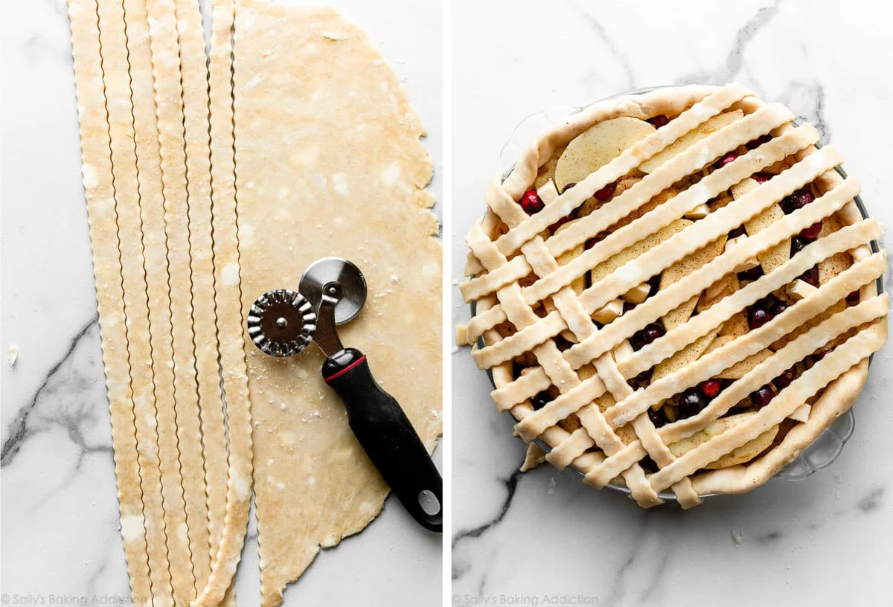

> Společně připravíme výborný jablečný koláč, znalosti využiješ i při vánočním pečení!

## Těsto

---

* `400 g` hladké mouky
* `12g` prášek do pečiva (1 sáček)
* `125 g` cukr moučka
* `1 špetka` soli
* `200 g` máslo (změklé, né rozpuštěné)
* `2-3 ks` střednich vajec (žloutky)

> Smíchej hladkou mouku, prášek do pečiva, cukr, špetku soli, máslo, vajíčka (žloutky) v míse.
>
> Hněť (míchej) rukama ingredience dokud nevytvoří homogenní hmotu a malá kulička této hmoty při zmáčknutí v dlani mírně praská po okrajích 
>
>>> příliš suché → přidat máslo, příliš vlhké → přidat mouku
>
> Homogení hmotu (těsto) přiklop a dej prozatím do ledničky

## Jablečná náplň

---

* `7 ks` středních jablek
* `2 lžíce` moučkového cukru
* `1 lžičky` skořice (podzimní)

> Okroužlej (oloupej) jablka a nakrájej na kostky, proužky nebo plátky (přibližně `1 cm` tlusté)
>
>Jablka vhoď do hrnce, zasypej cukrem a vař na druhý nejvyšší stupeň dokud nezkaramelizují.
>
> Skořici nasypej až ve chvíli, kdy budeš vypínat varnou desku.

## Plnění jablky & dekorace

---

* těsto z ledničky
* forma na koláč
* pečící papír o šířce formy
* egg wash
* `dobrovolně` vykrajovátka

> Předehřej troubu na `180 °C`.
>
> Vyndej těsto z lednice a postupně jej vkládej a dusej ve formě, dokud nedosáhneš rovnoměrné tlouštky `0.5 cm` po celé ploše a stranách formy
>
>>> pozor aby v rohu formy nebylo příliš těsta
>
> Vyklop vařené jablka na těsto ve formě a rovnoměrně rozetři.
>
> Dlaň těsta dej na rozložený pečící papír a válečkem vyválej na stejnou tloušťku těsta ve formě.
>
> Vyválej tvar shodných rozměrů jako je forma. Nakrájej rozválené těsto na proužky
>
> Proužky opatrně překlop z pečícího papíru do ruky/obracečky a polož na jablka (nejčastější metodou krusty je mřížka - lattice).
>
> 
>
> Pro další dekoraci je možné použít vykrajovátka, nebo těsto rozdrobit přes plochu koláče.
>
>>> krustu koláče potři rozmíchaným vajíčkem (nebo jen žloutkem) s vodou/mlíkem (egg wash)
>

## Pečení & Servírování 🥧

---
* trouba na `180 °C`
* šlehačka
* tvaroh s cukrem
* cukr moučka

> Po dokončení dekorace vlož formu s koláčem do předehřáté trouby na `180 °C` po dobu `45` minut.
>
> Po vytažení z trouby servíruj samotné nebo s některou z volitelných možností
